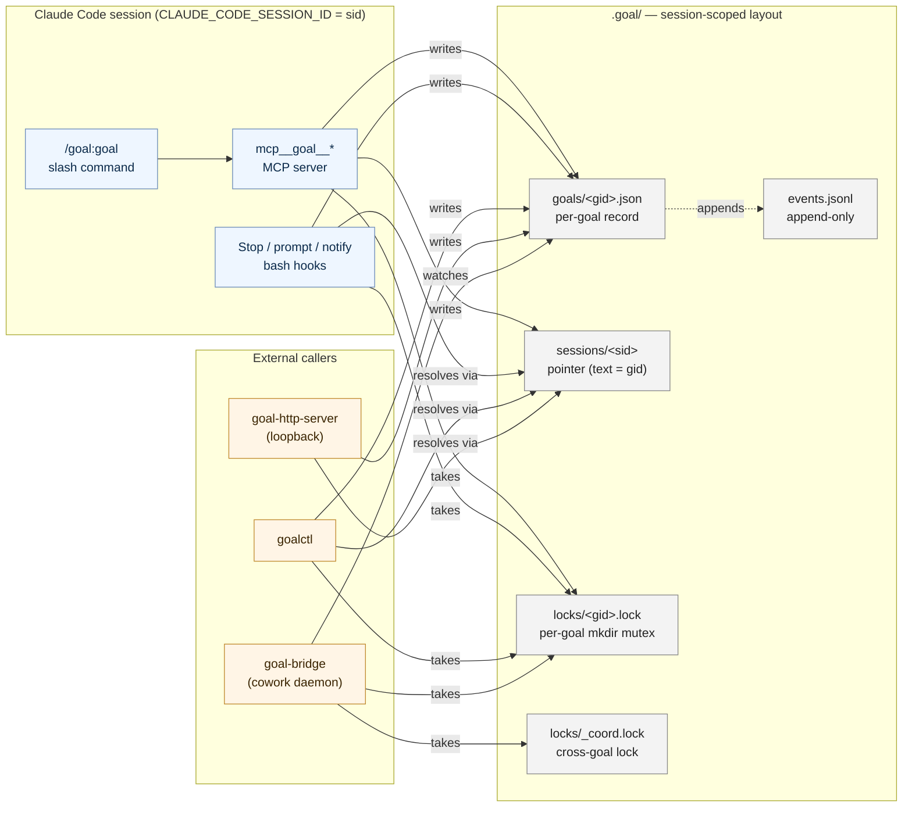
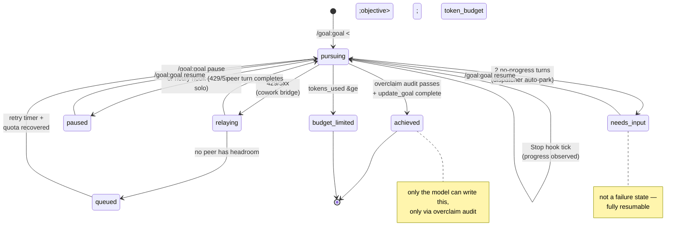

<p align="center">
  
</p>

<p align="center">
  Durable task goals for Claude Code: turn a high-level objective into auditable tasks, keep working across turns, show truthful status, and only claim completion when evidence supports it.
</p>

---

## Why use it

Claude Code's built-in [`/goal`](https://code.claude.com/docs/en/goal) is the right default for a single Claude session that should keep working until a clear condition is met.

This plugin is for work that needs to survive beyond one session:

- A refactor or migration that may take hours.
- A release checklist where "done" needs concrete evidence.
- A run you want visible in the statusline and controllable from a terminal.
- A goal that should continue after `/clear`, compaction, restarts, or multiple Claude Code windows.
- A task that can hand off between Claude Code and Codex when one provider is rate-limited.

In Claude Code versions that also ship a native `/goal`, invoke this plugin explicitly as `/goal:goal`. If your slash command picker shows the plugin command as bare `/goal`, that alias is equivalent.

Use Claude Code's built-in `/goal` instead when the work is a single-session task with a clear finish line and you do not need durable files, statusline visibility, terminal control, or handoff. This plugin earns its overhead when the run needs task checkpoints, evidence, interruption control, or recovery across sessions.

## What you get

| Feature | What it does |
|---|---|
| Durable project state | Stores each goal as its own file under `.goal/goals/<goal_id>.json`, owned by exactly one session via `.goal/sessions/<sid>` — not only the current chat transcript. |
| Task-level framing | `goalframe` turns the objective into a compact spec plus 3-7 task checkpoints that initialize the audit checklist. |
| Audit-gated completion | The model can mark a goal complete only after checking the prompt against concrete files, commands, tests, and artifacts. |
| Auto-continuation | A Claude Code `Stop` hook keeps the run moving while status is `pursuing`. |
| Statusline | Shows the owned goal, current task, audit count, active time, budget/cost, terminal state, and cowork relay or queue state. |
| MCP tools | Gives the model structured tools for goal state, progress, breadcrumbs, lane leases, handoffs, relay, queueing, and steering. |
| Headless control | `goalctl` and a loopback HTTP shim let scripts, CI, IDEs, and scheduled jobs control the same goal. |
| Cowork relay | Claude Code and Codex can pursue the same goal through shared state and handoff envelopes. |
| Rate-limit recovery | 429/5xx faults can relay to a peer or queue until provider headroom returns. |
| Safety controls | Shared lock, atomic writes, CAS checks, `.goal/pause` kill switch, relay guardrail, local-only HTTP. |
| Observability | `.goal/events.jsonl` and `goal-otel-exporter` emit lifecycle, relay, queue, and lane-conflict events. |

## Install

Paste this into Claude Code, Cursor, another coding agent, or a terminal:

```bash
git clone https://github.com/pyyush/goal ~/goal && cd ~/goal && ./bin/goal-setup --non-interactive
```

Restart Claude Code after install so hooks, statusline, and the MCP server register.

To inspect the statusline wiring without changing it later, run:

```bash
goal-statusline-install --audit
```

Rollback is scope-local: remove or disable this plugin in the Claude scope where it was installed, or delete the generated hook/statusline/MCP entries from that scope's Claude settings. Existing `.goal/` records are ordinary project files and can be kept for history or removed after the run is no longer needed.

<details>
<summary>Manual install</summary>

```bash
git clone https://github.com/pyyush/goal
cd goal
./bin/goal-setup            # interactive: scope, MCP server, statusline
# or: ./install.sh user     # minimal: hooks only
```

Useful setup flags:

```text
--dry-run
--non-interactive
--scope user|project
```

</details>

## Quickstart

```text
/goal:goal Refactor the auth module to use the new session API; run tests until green
```

Claude Code keeps working until the goal is audited as complete, parked for input, paused, budget-limited, or cleared. No model grades completion — the loop is a deterministic state machine and completion is Claude's own audited call.

```text
/goal:goal status
/goal:goal tasks
/goal:goal next
/goal:goal steer Keep public auth exports unchanged
/goal:goal pause
/goal:goal resume
/goal:goal budget 50000
/goal:goal achieved
/goal:goal debrief
/goal:goal clear
```

Daily model:

```text
Start:      /goal:goal <outcome>
Watch:      /goal:goal status     or goalctl watch
Inspect:    /goal:goal tasks      or /goal:goal next
Steer:      /goal:goal steer "prefer tests before cleanup"
Interrupt:  /goal:goal pause
Resume:     /goal:goal resume
Join:       /goal:goal adopt <goal_id>
Verify:     /goal:goal audit
Finish:     /goal:goal achieved
```

## Claude built-in `/goal` vs this plugin

| Need | Claude Code built-in `/goal` | This plugin |
|---|---|---|
| One session, simple condition | Best fit. | Works, but heavier than needed. |
| Survive `/clear`, compaction, or restart | Session-bound behavior. | Goal state persists at `.goal/goals/<goal_id>.json`; the owning session re-binds on next launch. |
| Inspect files/tests before completion | Evaluator checks conversation context; it does not run tools. | Audit checklist maps requirements to files, commands, and evidence. |
| Terminal/CI/IDE control | Not the focus. | `goalctl`, HTTP, MCP, and git sync operate on the same state. |
| Multi-agent handoff | Not the focus. | Claude Code ↔ Codex relay through `.goal/handoff/`. |
| Rate-limit resilience | Stays with the current provider/session. | Relay, queue, and resume when provider headroom returns. |

## Architecture

A goal is **owned by exactly one session**. The on-disk layout makes that explicit:

```
.goal/
  goals/<goal_id>.json       per-goal record   (writers: MCP, Stop hook, /goal:goal)
  sessions/<session_id>      pointer file      (content: the owned goal_id)
  locks/<goal_id>.lock       per-goal mkdir mutex
  locks/_coord.lock          cross-goal coordination lock (lanes, handoff seq)
  cursors/<goal_id>          dispatcher progress cursor (tool-call count + wt hash)
  events.jsonl               append-only diagnostics
  pause                      hard kill switch
```

Resolution is read-only: the bash resolver and MCP both look up `sessions/<sid>` to find which `goals/<gid>.json` to act on, and they never adopt a session into a goal as a side effect of resolving. Two Claude sessions in one folder produce two independent records under two per-goal locks — they never share a mutable file.

Writes are atomic (`mktemp` + `rename(2)`) and CAS-guarded by `goal_id`. The MCP server's per-goal lock and the bash hooks' per-goal `mkdir` mutex use the same lockfile path, so both runtimes serialize against each other.



### Lifecycle

The model can reach `achieved` only through the `overclaim` audit. `paused`, `clear`, and budget changes are user/system actions — the model can never write a failure state.



### Cowork relay (opt-in)

```mermaid
sequenceDiagram
    autonumber
    participant CC as Claude Code<br/>(Stop hook)
    participant G as goals/&lt;gid&gt;.json
    participant L as locks/_coord.lock
    participant H as handoff/NNNN.md
    participant BR as goal-bridge<br/>(codex)
    participant CX as Codex CLI

    CC->>G: status=pursuing<br/>current.agent=claude-code-...
    Note over CC,CX: rate-limit hit (429)
    CC->>L: acquire coord lock
    CC->>H: write handoff envelope<br/>(seq=NNNN, from=cc, to=codex)
    CC->>G: status=relaying<br/>current.agent=codex-...<br/>handoff_head=NNNN
    CC->>L: release
    BR-->>G: watcher fires (fs.watch on goals/)
    BR->>G: resolveMyGoal()<br/>current.agent matches AGENT_ID
    BR->>H: read handoff body
    BR->>CX: spawn turn with handoff context
    CX-->>BR: turn.completed
    BR->>G: status=pursuing<br/>(peer picked up)
```

## Cowork and rate-limit relay

Cowork is opt-in. Add `.goal/cowork.yml`, start a peer bridge, and agents can hand off through the same goal state.

```bash
goalctl cowork init
goalctl bridge start codex --root /path/to/project
```

When a runner hits a rate limit or server error:

1. The bridge writes `.goal/handoff/NNNN.md`.
2. The goal record moves to `relaying`.
3. The peer reads the handoff and continues.
4. State returns to `pursuing` after the peer's first successful turn.
5. If every configured provider is throttled, the goal becomes `queued` until headroom returns.

See [docs/cowork.md](docs/cowork.md) for the full protocol.

## Headless control

For CI, scheduled jobs, IDE plugins, and local scripts:

```bash
goalctl create "Ship the migration" --budget 5000
goalctl status --json | jq '.remaining_tokens'
goalctl tasks
goalctl next
goalctl audit
goalctl steer "prioritize focused tests before docs"
goalctl pause / resume / clear
goalctl listen --grep created
goalctl serve-http --port 7474
goalctl watch
goalctl template list
goalctl pr --json
goalctl sync push / sync pull
```

The HTTP shim binds `127.0.0.1` only and exposes:

| Method | Path | Notes |
|---|---|---|
| `GET` | `/goal[?goal=<gid>]` | Returns the resolved goal record. Resolution: `?goal=<gid>` → `X-Claude-Session-Id` header → single-active fallback. |
| `POST` | `/goal` | Create a new goal. Pass `X-Claude-Session-Id` to bind a per-session goal; otherwise refuses if any active goal already exists. |
| `PATCH` | `/goal[?goal=<gid>]` | `{"action":"pause"\|"resume"\|"clear"\|"set-budget"\|"mark-needs-input"}`. `clear` returns 204. |
| `GET` | `/goals` | List every goal in the project. |
| `GET` | `/events?since=<iso>` | NDJSON event stream from `.goal/events.jsonl`. |
| `GET` | `/healthz` | `ok`. |

## MCP tools

The bundled MCP server exposes model-side tools under `mcp__goal__*`:

| Tool | Behavior |
|---|---|
| `create_goal`, `get_goal`, `update_goal` | Create, read, and complete goals. `create_goal` materializes `spec.tasks[]` into audit checkpoints; `update_goal` only accepts completion. |
| `report_progress`, `report_stuck`, `record_breadcrumb` | Maintain task/audit evidence, stuck state, and approach history. `report_progress` accepts overclaim support levels such as `confirmed`, `partial`, and `blocked`. |
| `claim_lane`, `release_lane` | Coordinate file/path ownership between agents. |
| `write_handoff`, `peer_status`, `relay_now` | Create and inspect handoffs, force relay, and check peer health. |
| `queue_message`, `steer_message` | Route queued and mid-turn instructions safely. |

The server also declares a Claude `goal/continue` push channel so idle sessions can be re-engaged without waiting for another user prompt.

## Statusline

The statusline renders the owned goal as a compact cockpit segment — and only in the session that owns the goal, so an unrelated shell in the same directory shows nothing.

| State | Shown as |
|---|---|
| Pursuing (healthy) | teal `◎ <title> · t3 current task · N/M · 12m` |
| Pursuing (stalled) | amber `◍ goal stalled · t3 current task · no progress last turn` |
| Needs input | orange `◌ needs input · t3 blocker · /goal:goal resume after fix` |
| Achieved | green `✓ goal achieved · <title> · 23m · 47.0K` |
| Budget-limited | red `⊘ budget limit · <title> · current task` |
| Relaying | violet `↔ relaying · <title> · t7 final audit · codex` |
| Queued | amber `⌛ queued · t7 final audit · retry <time>` |
| No goal | the segment is absent |

The live timer uses `statusLine.refreshInterval` — no background daemon, no writes to `/dev/tty` (which hooks no longer have). The timer counts active pursuit time only; paused time is excluded. Terminal states keep their final time/token snapshots. See `docs/goal-statusline-cockpit.html` for the full interactive mockup.

## Reliability model

- Objectives are wrapped as untrusted data so a goal cannot smuggle higher-priority instructions.
- Completion is audit-gated and evidence-backed.
- The model cannot pause, resume, clear, mark a failure, or raise its own budget — `update_goal` is asymmetric and only marks complete (the same contract Codex enforces).
- `.goal/pause` halts the loop from any terminal.
- Notification hooks pause on API errors in solo mode.
- Cowork mode relays or queues on rate limits.
- Relay guardrail prevents ping-pong loops from burning quota.
- Runtime files live under `.goal/` and are ignored for project installs.

## Configuration

| Var | Default | What |
|---|---|---|
| `GOAL_AUTOPAUSE_ON_PROMPT` | `0` | When `1`, the prompt hook pauses the active goal on every user prompt that isn't `/goal …` or `/goal:goal …`. |
| `GOAL_STRIKE_LIMIT` | `2` | Consecutive no-progress turns before the dispatcher parks the goal to `needs-input`. |
| `GOAL_REFRESH_EVERY` | `25` | Tick interval for full-spec refresh in the dispatcher's continuation prompt (short prompt by default). |
| `GOAL_PUSH_INTERVAL_SECONDS` | unset | Optional MCP channel timer push. |
| `GOAL_CHANNEL_DISABLE` | `0` | Disable only the push channel. |
| `GOAL_CHANNEL_DEBOUNCE_MS` | `5000` | Debounce window between channel pushes vs Stop-hook ticks. |
| `GOAL_LOCK_TIMEOUT_MS` | `5000` | Shared mutex acquire timeout. |
| `GOAL_LOCK_STALE_MS` | `30000` | Stale lock takeover threshold. |
| `GOAL_RELAY_LIMIT_PER_HOUR` | `3` | Automatic relay guardrail. |
| `GOAL_HEARTBEAT_TTL_MS` | `15000` | Stale heartbeat threshold for cowork agents. |
| `GOAL_OTEL_ENDPOINT` | unset | OTLP HTTP endpoint for `goal-otel-exporter`. |
| `GOAL_DISABLE_MIGRATION` | `0` | Skip the v1 → v2 → v3 forward migration on first touch. |
| `CLAUDE_CODE_SESSION_ID` / `CLAUDE_SESSION_ID` / `GOAL_SESSION_ID` | set by Claude Code / test harnesses | Used by the MCP server, `goalctl`, and the HTTP shim to resolve which goal this session owns. |

## Troubleshooting

**Loop is not firing.** Check `jq '.hooks.Stop' ~/.claude/settings.json`, then restart Claude Code.

**Statusline is missing.** Confirm `~/.claude/hooks/goal-statusline.sh` is executable and your statusLine command passes `cwd` and `session_id` on stdin. The bundled `statusline.sh` handles this.

**Goal stuck after a rate limit.** In cowork mode, check `goalctl quota`, `.goal/events.jsonl`, and the peer bridge. In solo mode, run `/goal:goal resume` after the provider recovers.

**Handoff was not picked up.** Check `.claude/goal-hook.log`, `.goal/agents/<runner>.log`, and `.goal/agents/<runner>.pid`. Restart the peer bridge with `goalctl bridge start codex`.

**Need to stop immediately.** Run `touch .goal/pause`.

## Requirements

- macOS or Linux (Windows via WSL)
- `bash` 3.2+, `jq`, `uuidgen`
- Node 18+ for MCP, HTTP, telemetry, and bridge helpers

## License

[MIT](LICENSE)
