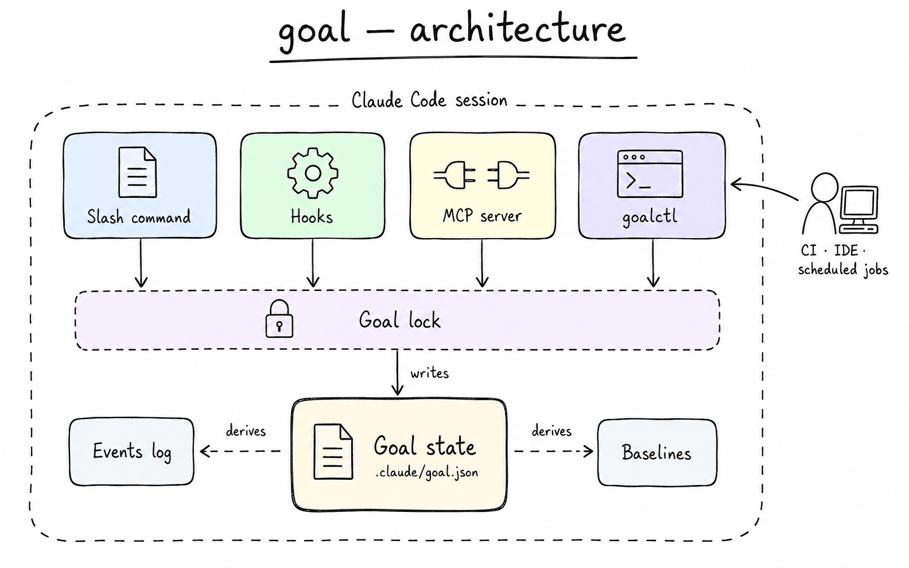
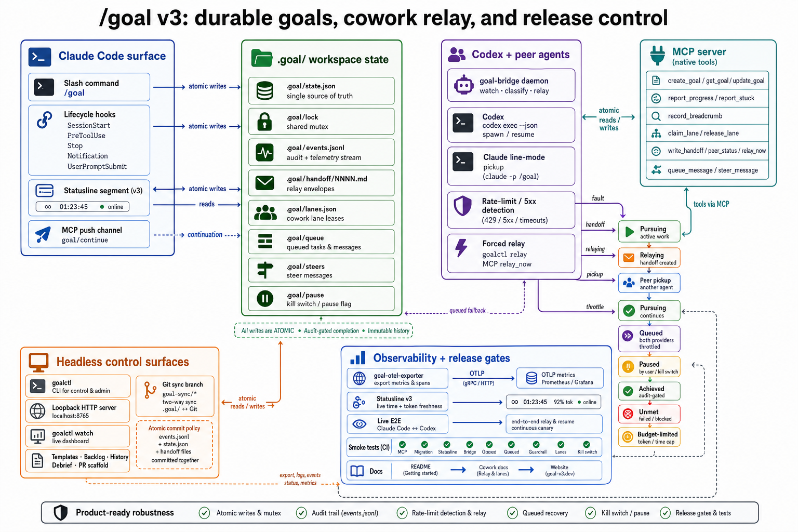

<p align="center">
  
</p>

<p align="center">
  Durable goals for Claude Code: project-scoped state, audit-gated completion, statusline visibility, MCP tools, and Claude Code ↔ Codex handoff when rate limits get in the way.
</p>

---

## Why use it

Claude Code's built-in [`/goal`](https://code.claude.com/docs/en/goal) is the right default for a single Claude session that should keep working until a clear condition is met.

This plugin is for work that needs to survive beyond one session:

- A refactor or migration that may take hours.
- A release checklist where "done" needs concrete evidence.
- A run you want visible in the statusline and controllable from a terminal.
- A goal that should continue after `/clear`, compaction, restarts, or multiple Claude Code windows.
- A task that can hand off between Claude Code and Codex when one provider is rate-limited.

In scopes where this plugin is enabled, `/goal` is this project-scoped implementation. Disable the plugin in that scope to use Claude Code's built-in command there.

## What you get

| Feature | What it does |
|---|---|
| Durable project state | Stores the active goal in `.goal/state.json`, not only the current chat transcript. |
| Audit-gated completion | The model can mark a goal complete only after checking the prompt against concrete files, commands, tests, and artifacts. |
| Auto-continuation | A Claude Code `Stop` hook keeps the run moving while status is `pursuing`. |
| Statusline | Shows active time, budget, terminal state, cowork relay state, and stale token observations. |
| MCP tools | Gives the model structured tools for goal state, progress, breadcrumbs, lane leases, handoffs, relay, queueing, and steering. |
| Headless control | `goalctl` and a loopback HTTP shim let scripts, CI, IDEs, and scheduled jobs control the same goal. |
| Cowork relay | Claude Code and Codex can pursue the same goal through shared state and handoff envelopes. |
| Rate-limit recovery | 429/5xx faults can relay to a peer or queue until provider headroom returns. |
| Safety controls | Shared lock, atomic writes, CAS checks, `.goal/pause` kill switch, relay guardrail, local-only HTTP. |
| Observability | `.goal/events.jsonl` and `goal-otel-exporter` emit lifecycle, relay, queue, and lane-conflict events. |

## Install

Paste this into Claude Code, Cursor, another coding agent, or a terminal:

```bash
git clone https://github.com/pyyush/goal ~/goal && cd ~/goal && ./bin/goal-setup --non-interactive
```

Restart Claude Code after install so hooks, statusline, and the MCP server register.

<details>
<summary>Manual install</summary>

```bash
git clone https://github.com/pyyush/goal
cd goal
./bin/goal-setup            # interactive: scope, MCP server, statusline
# or: ./install.sh user     # minimal: hooks only
```

Useful setup flags:

```text
--dry-run
--non-interactive
--scope user|project
```

</details>

## Quickstart

```text
/goal Refactor the auth module to use the new session API; run tests until green
```

Claude Code keeps working until the goal is audited as complete, declared unmet, paused, budget-limited, or cleared.

```text
/goal status
/goal pause
/goal resume
/goal budget 50000
/goal achieved
/goal clear
```

## Claude built-in `/goal` vs this plugin

| Need | Claude Code built-in `/goal` | This plugin |
|---|---|---|
| One session, simple condition | Best fit. | Works, but heavier than needed. |
| Survive `/clear`, compaction, or restart | Session-bound behavior. | Project state persists in `.goal/state.json`. |
| Inspect files/tests before completion | Evaluator checks conversation context; it does not run tools. | Audit checklist maps requirements to files, commands, and evidence. |
| Terminal/CI/IDE control | Not the focus. | `goalctl`, HTTP, MCP, and git sync operate on the same state. |
| Multi-agent handoff | Not the focus. | Claude Code ↔ Codex relay through `.goal/handoff/`. |
| Rate-limit resilience | Stays with the current provider/session. | Relay, queue, and resume when provider headroom returns. |

## Architecture

`.goal/state.json` is the single source of truth. The slash command, hooks, MCP server, bridge, `goalctl`, and HTTP shim all coordinate through `.goal/lock`. Writes are atomic (`mktemp` + `rename(2)`) and CAS-guarded by `goal_id`.

<p align="center">
  
</p>

### System map

<p align="center">
  
</p>

## Cowork and rate-limit relay

Cowork is opt-in. Add `.goal/cowork.yml`, start a peer bridge, and agents can hand off through the same goal state.

```bash
goalctl cowork init
goalctl bridge start codex --root /path/to/project
```

When a runner hits a rate limit or server error:

1. The bridge writes `.goal/handoff/NNNN.md`.
2. `state.json` moves to `relaying`.
3. The peer reads the handoff and continues.
4. State returns to `pursuing` after the peer's first successful turn.
5. If every configured provider is throttled, the goal becomes `queued` until headroom returns.

See [docs/cowork.md](docs/cowork.md) for the full protocol.

## Headless control

For CI, scheduled jobs, IDE plugins, and local scripts:

```bash
goalctl create "Ship the migration" --budget 5000
goalctl status --json | jq '.remaining_tokens'
goalctl pause / resume / clear
goalctl listen --grep created
goalctl serve-http --port 7474
goalctl watch
goalctl template list
goalctl pr --json
goalctl sync push / sync pull
```

The HTTP shim binds `127.0.0.1` only and exposes `GET /goal`, `POST /goal`, `PATCH /goal`, `DELETE /goal`, and `GET /events?since=<iso>`.

## MCP tools

The bundled MCP server exposes model-side tools under `mcp__goal__*`:

| Tool | Behavior |
|---|---|
| `create_goal`, `get_goal`, `update_goal` | Create, read, and complete goals. `update_goal` only accepts completion. |
| `report_progress`, `report_stuck`, `record_breadcrumb` | Maintain audit evidence, stuck state, and approach history. |
| `claim_lane`, `release_lane` | Coordinate file/path ownership between agents. |
| `write_handoff`, `peer_status`, `relay_now` | Create and inspect handoffs, force relay, and check peer health. |
| `queue_message`, `steer_message` | Route queued and mid-turn instructions safely. |

The server also declares a Claude `goal/continue` push channel so idle sessions can be re-engaged without waiting for another user prompt.

## Statusline

The statusline gives you a compact run state:

| State | Example |
|---|---|
| Pursuing | `Pursuing goal (12.5K / 50K)` |
| Paused | `Goal paused (/goal resume)` |
| Achieved | `Goal achieved (1h 23m)` |
| Unmet | `Goal unmet (/goal status)` |
| Budget-limited | `Goal abandoned (50K / 50K)` |
| Cowork active | `cowork: codex→build | claude=review idle | 8/14 audited` |
| Relaying | `Relaying claude-code → codex…` |
| Queued | `Queued — retry at 14:47 (anthropic + openai throttled)` |

The timer tracks active pursuit time. Paused time is excluded. Final states keep their final time/token snapshots.

## Reliability model

- Objectives are wrapped as untrusted data so a goal cannot smuggle higher-priority instructions.
- Completion is audit-gated and evidence-backed.
- The model cannot pause, resume, clear, mark unmet, or raise its own budget through MCP.
- `.goal/pause` halts the loop from any terminal.
- Notification hooks pause on API errors in solo mode.
- Cowork mode relays or queues on rate limits.
- Relay guardrail prevents ping-pong loops from burning quota.
- Runtime files live under `.goal/` and are ignored for project installs.

## Configuration

| Var | Default | What |
|---|---|---|
| `GOAL_MAX_TICKS` | `0` | Continuation cycle cap. `0` means unlimited. |
| `GOAL_MAX_SECONDS` | `0` | Wall-clock cap. Useful for API-billed runs. |
| `GOAL_AUTOPAUSE_ON_PROMPT` | `0` | Pause on user prompt when set to `1`. |
| `GOAL_PUSH_INTERVAL_SECONDS` | unset | Optional MCP channel timer push. |
| `GOAL_CHANNEL_DISABLE` | `0` | Disable only the push channel. |
| `GOAL_LOCK_TIMEOUT_MS` | `5000` | Shared mutex acquire timeout. |
| `GOAL_LOCK_STALE_MS` | `30000` | Stale lock takeover threshold. |
| `GOAL_RELAY_LIMIT_PER_HOUR` | `3` | Automatic relay guardrail. |
| `GOAL_OTEL_ENDPOINT` | unset | OTLP HTTP endpoint for `goal-otel-exporter`. |

## Troubleshooting

**Loop is not firing.** Check `jq '.hooks.Stop' ~/.claude/settings.json`, then restart Claude Code.

**Statusline is missing.** Confirm `~/.claude/hooks/goal-statusline.sh` is executable and your statusLine command passes `cwd` and `session_id` on stdin. The bundled `statusline.sh` handles this.

**Goal stuck after a rate limit.** In cowork mode, check `goalctl quota`, `.goal/events.jsonl`, and the peer bridge. In solo mode, run `/goal resume` after the provider recovers.

**Handoff was not picked up.** Check `.claude/goal-hook.log`, `.goal/agents/<runner>.log`, and `.goal/agents/<runner>.pid`. Restart the peer bridge with `goalctl bridge start codex`.

**Need to stop immediately.** Run `touch .goal/pause`.

## Requirements

- macOS or Linux (Windows via WSL)
- `bash` 3.2+, `jq`, `uuidgen`
- Node 18+ for MCP, HTTP, telemetry, and bridge helpers

## License

[MIT](LICENSE)
