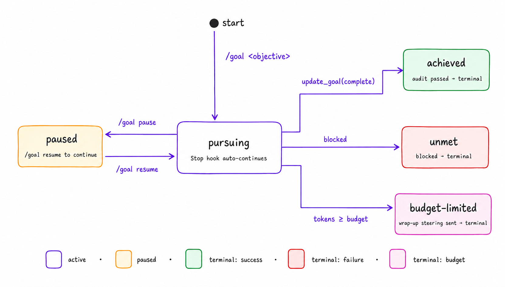

<p align="center">
  
</p>

<p align="center">
  A <a href="https://code.claude.com/docs/en/plugins">Claude Code plugin</a> that bundles a <code>/goal</code> slash command, three hooks, an MCP server with a push channel, and a statusline indicator — so the model keeps pursuing a long objective across turns until it audits as done, hits its budget, or gets paused.
</p>

---

## What you get

- **`/goal <objective>`** — set a durable goal. State persists at `.claude/goal.json` across `/clear`, `/compact`, `--resume`, and session restarts.
- **Auto-continuation** — a `Stop` hook returns `{decision:"block"}` after each turn while the goal is `pursuing`. Same loop shape as Anthropic's own [ralph-wiggum](https://github.com/anthropics/claude-code/tree/main/plugins/ralph-wiggum) plugin, with explicit lifecycle states layered on top.
- **Push channel** — the bundled MCP server declares the `claude/channel` capability and pushes short "keep working" messages into idle sessions, so unattended runs don't stall.
- **Token budget that bites** — the hook reads the session transcript, deltas output tokens against a per-goal baseline, and flips status to `budget-limited` with a wrap-up steering message when the budget is hit.
- **Audit-gated completion** — the model can only declare `achieved` after a prompt-to-artifact checklist clears. No false positives from "I implemented it" intuition.
- **Concurrent-session safe** — all four writers (slash command, hooks, MCP server, `goalctl`) coordinate through a single mutex at `.claude/goal.lock`.
- **CLI + Desktop** — both surfaces read the same `~/.claude.json`, so one install covers both.

## Install

Paste this to Claude Code / Cursor / any coding agent — or run it in a terminal:

```bash
git clone https://github.com/pyyush/goal ~/goal && cd ~/goal && ./bin/goal-setup --non-interactive
```

That clones the repo, installs the hooks, builds the MCP server, and patches `~/.claude.json` in one shot. Then **restart Claude Code** (CLI or quit-and-reopen Desktop) so the hooks and MCP server register.

<details>
<summary>Manual install (interactive prompts)</summary>

```bash
git clone https://github.com/pyyush/goal
cd goal
./bin/goal-setup            # interactive — prompts for scope, MCP server, statusline
# or: ./install.sh user     # minimal: hooks only, no MCP server, no statusline
```

`goal-setup` flags: `--dry-run` (preview), `--non-interactive` (accept defaults), `--scope user|project`.

</details>

## Quickstart

```text
/goal Refactor the auth module to use the new session API; run tests until green
```

The model now keeps working on this across every turn until it can audit it as `achieved`, declares `unmet`, or you intervene with `/goal pause` / `/goal clear`.

## Commands

```text
/goal <objective>          set or replace the active goal
/goal                      show 1-line status (the Stop hook handles continuation)
/goal status               full status, never continues
/goal pause | resume       pause / unpause the auto-continuation loop
/goal achieved             mark complete — runs the audit first, refuses on a fail
/goal unmet [note]         mark blocked
/goal budget <N>           set a positive-integer token budget
/goal clear                delete the goal
```

Subcommands are case-insensitive on the first token. Anything else is treated as a new objective.

## Architecture

<p align="center">
  
</p>

`.claude/goal.json` is the single source of truth. All four writers — the slash command, the hooks, the MCP server, and the headless `goalctl` / HTTP shim — coordinate through a `proper-lockfile`-compatible mkdir mutex at `.claude/goal.lock`. Each write is atomic (`mktemp` + `rename(2)`) and CAS-guarded by `goal_id`, so a write from a stale view is rejected even if the lock somehow leaks.

## Lifecycle

<p align="center">
  
</p>

A goal lives in one of five states. Transitions are user-initiated (`pause` / `resume` / `clear` / `unmet`), model-initiated (only `achieved`, and only after an audit), or runtime-driven (`budget-limited` when `tokens_used ≥ token_budget`). The MCP `update_goal` tool is deliberately asymmetric — the model cannot pause, resume, or modify its own budget. Those are user / orchestrator decisions.

## Concurrency

Run multiple Claude Code sessions on the same project — CLI + Desktop side by side, two CLI sessions in different terminals — and `goal` stays consistent. Tunables: `GOAL_LOCK_TIMEOUT_MS` (default 5000), `GOAL_LOCK_STALE_MS` (default 30000). A stuck lock auto-recovers when the owning PID is gone or the hold exceeds the stale threshold.

A concurrency stress test ships at [`scripts/smoke-phase-1.sh`](scripts/smoke-phase-1.sh) — 20 parallel atomic increments serialize to 20 with the lock; without it 18 of 20 updates are lost.

## Headless / SDK drive (`goalctl`)

For CI, scheduled jobs, IDE plugins, multi-agent orchestrators:

```bash
goalctl create "Ship the migration" --budget 5000
goalctl status --json | jq '.remaining_tokens'
goalctl pause / resume / clear
goalctl set-budget 10000
goalctl mark-unmet "blocked on review"
goalctl listen --grep created          # tail .claude/goal-events.jsonl
goalctl serve-http --port 7474         # local HTTP RPC (127.0.0.1 only)
```

The HTTP shim exposes `GET / POST / PATCH /goal` and `GET /events?since=<iso>` (NDJSON stream). No auth — loopback bind only. See [`bin/goal-http-server.ts`](bin/goal-http-server.ts) for the full surface.

## MCP server (native tools + push channel)

The MCP server in [`mcp/`](mcp/README.md) exposes three native tools the model calls as structured tool uses:

| Tool | Behavior |
|---|---|
| `mcp__goal__create_goal` | Create a goal. Fails if one is already active. |
| `mcp__goal__update_goal` | Mark complete. Asymmetric: only `status: "complete"` is accepted. |
| `mcp__goal__get_goal` | Return current state + computed `remaining_tokens` and `elapsed_seconds`. |

The same server declares the `claude/channel` capability with channel id `goal/continue`. It pushes a short *"continue working — call `get_goal()` if you need the objective"* message into the session at boot, after `.claude/goal.json` mtime bumps (debounced against the Stop hook), and optionally on a timer (`GOAL_PUSH_INTERVAL_SECONDS=N`). This is what closes the *idle continuation* gap: when the model has finished a turn and no Stop hook has fired in a while, the channel re-engages it.

Channel kill switches: `touch .claude/goal.pause`, `GOAL_CHANNEL_DISABLE=1`, status not `pursuing`, budget exhausted, or any active ceiling. Every push outcome is logged to `.claude/goal-events.jsonl` for audit.

## Statusline

Adds one magenta segment to your statusline, showing the live goal state:

| State | Label |
|---|---|
| `pursuing` (no budget) | `Pursuing goal (5m)` |
| `pursuing` (with budget) | `Pursuing goal (12.5K / 50K)` |
| `paused` | `Goal paused (/goal resume)` |
| `achieved` | `Goal achieved (1h23m)` |
| `unmet` | `Goal unmet (/goal status)` |
| `budget-limited` | `Goal abandoned (50K / 50K)` |

`goal-setup` wires it for you. `GOAL_STATUSLINE_STYLE=dim|plain` for softer / monochrome.

## Configuration

| Var | Default | What |
|---|---|---|
| `GOAL_MAX_TICKS` | `0` (unlimited) | Hard cap on continuation cycles. |
| `GOAL_MAX_SECONDS` | `0` (unlimited) | Wall-clock cap. Useful for API-billed runs. |
| `GOAL_AUTOPAUSE_ON_PROMPT` | `0` | Set to `1` to pause on every user prompt. |
| `GOAL_PUSH_INTERVAL_SECONDS` | unset | Channel timer push, off by default. |
| `GOAL_CHANNEL_DISABLE` | `0` | Set to `1` to disable just the push channel. |
| `GOAL_CHANNEL_DEBOUNCE_MS` | `5000` | Channel skip-window after a Stop-hook tick. |
| `GOAL_LOCK_TIMEOUT_MS` | `5000` | Mutex acquire timeout. |
| `GOAL_LOCK_STALE_MS` | `30000` | Stale-lock takeover threshold. |
| `GOAL_OTEL_ENDPOINT` | unset | When set, `goal-otel-exporter` ships metrics to this OTLP HTTP endpoint. |

## Safety

- **`<untrusted_objective>` framing.** The objective is wrapped in nonce-tagged tags so a malicious goal can't smuggle higher-priority instructions. The model is explicitly told to treat the objective as data.
- **Audit-gated `achieved`.** Every claim of completion forces a prompt-to-artifact checklist before the goal flips to terminal-success.
- **Asymmetric model tool.** `update_goal` only accepts `complete`. The model cannot pause, resume, mark-unmet, or modify its own budget.
- **Kill switch.** `touch .claude/goal.pause` halts the loop instantly from any terminal — no chat access required.
- **Auto-pause on errors.** A `Notification` hook detects rate-limit / 5xx / overload / auth / timeout patterns and pauses the goal so it doesn't burn ticks against a degraded API.
- **Local-only headless surfaces.** `goalctl serve-http` binds `127.0.0.1` only.

## Observability

`goal-otel-exporter` tails `.claude/goal-events.jsonl` and emits OpenTelemetry counters (`goal.created`, `goal.completed`, `goal.unmet`, `goal.budget_limited`) and histograms (`goal.token_count`, `goal.continuation_turns`, `goal.elapsed_seconds`), all keyed by `goal_id`. Without `GOAL_OTEL_ENDPOINT` set it emits OTLP/JSON to stdout for piping.

## Troubleshooting

**Loop isn't firing.** Check `jq '.hooks.Stop' ~/.claude/settings.json` — should reference `goal-stop.sh`. Restart Claude Code after install.

**Status line missing.** `~/.claude/hooks/goal-statusline.sh` must be executable and your statusLine command must pass `cwd` + `session_id` from its stdin JSON. The bundled statusline (`statusline.sh`) handles both.

**Goal stuck in `paused` after rate-limit.** Run `/goal resume`. Auto-resume on API recovery isn't currently possible — Claude Code doesn't expose recovery events to hooks.

**Hook fires but nothing happens.** `tail -f .claude/goal-hook.log`. Common: `recursion-guard` (inside a continuation chain — normal), `not-pursuing` (intended exit), `malformed` (`/goal clear` and start over).

## Requirements

- macOS or Linux (Windows via WSL)
- `bash` 3.2+, `jq`, `uuidgen`
- Node 18+ (for the MCP server and HTTP shim — optional but recommended)

## License

[MIT](LICENSE)
