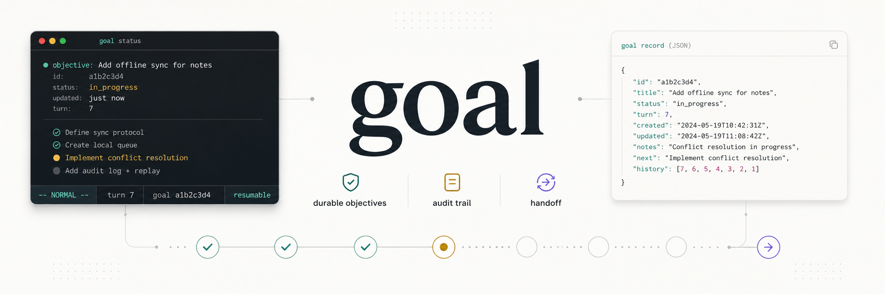
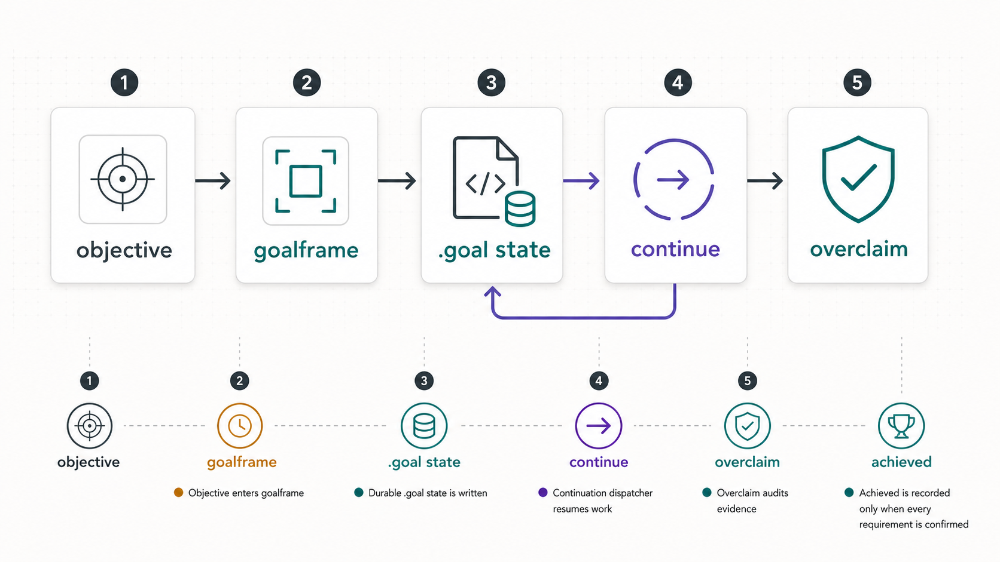
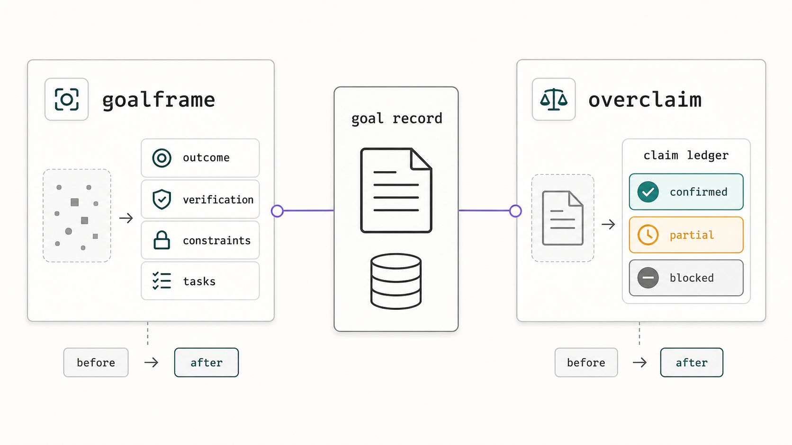
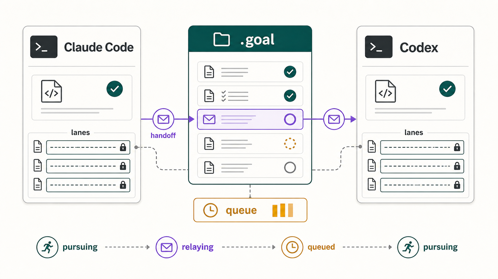

<p align="center">
  
</p>

# goal

`goal` is a durable objective layer for developer agents. It turns a high-level coding outcome into local state, task checkpoints, statusline visibility, and an evidence gate before model-side completion can be claimed.

Use Claude Code's built-in `/goal` for a single-session task. Use this plugin when the work needs to survive `/clear`, compaction, restarts, rate limits, or handoff between Claude Code and Codex.

## Why It Exists

Long coding runs fail in predictable ways: the objective drifts, status gets buried in the transcript, a restart loses context, or the model claims a finish before checking the actual files. `goal` makes those failure modes explicit and inspectable.

- File-backed state: every active goal lives under `.goal/goals/<goal_id>.json`.
- Session ownership: multiple Claude Code windows can work in one repo without sharing a mutable record accidentally.
- Task checkpoints: `goalframe` turns the raw ask into a compact, auditable work plan.
- Evidence discipline: `overclaim` blocks unsupported "done" claims.
- Local control: `goalctl`, MCP tools, hooks, statusline, HTTP, and cowork relay all operate on the same state.

## Install

This installs the slash command, hooks, statusline integration, MCP server wiring, and local CLI helpers.

```bash
git clone <repo-url> ~/goal
cd ~/goal
./bin/goal-setup --non-interactive
```

Restart Claude Code after install so the command, hooks, statusline, and MCP server register.

Useful checks:

```bash
./bin/goal-setup --dry-run
goal-statusline-install --audit
goalctl --help
```

Manual install is still available:

```bash
./install.sh user
```

Rollback is scope-local: remove or disable this plugin in the Claude scope where it was installed, or delete the generated hook/statusline/MCP entries from that scope's Claude settings. Existing `.goal/` records are ordinary project files.

## 60-Second Quickstart

Start a durable objective:

```text
/goal:goal Refactor the auth module to use the new session API; keep tests green
```

Inspect and steer it:

```text
/goal:goal status
/goal:goal tasks
/goal:goal next
/goal:goal steer "prefer focused tests before broad cleanup"
```

Control the same goal from a terminal:

```bash
goalctl status
goalctl tasks
goalctl next
goalctl pause
goalctl resume
goalctl clear
```

In Claude Code versions where the command picker exposes this plugin as bare `/goal`, that alias is equivalent. The explicit `/goal:goal` form avoids ambiguity with the native command.

## Core Loop



1. The user gives a developer outcome, not a chat instruction.
2. `goalframe` shapes it into outcome, verification, constraints, boundaries, and task checkpoints.
3. Runtime state is written under `.goal/` with atomic writes and per-goal locks.
4. Hooks, MCP tools, and `goalctl` keep the same record moving.
5. `overclaim` audits the evidence before model-side completion is recorded.

## Companion Skills



The custom skills are the product logic around the loop.

`goalframe` runs at intake. It converts a vague or oversized objective into a compact spec:

```json
{
  "title": "Migrate auth sessions",
  "outcome": "auth uses the new session API",
  "verification": "auth tests and smoke flow pass",
  "constraints": "public exports stay stable",
  "tasks": ["map call sites", "migrate core flow", "verify edge cases"]
}
```

`overclaim` runs at exit and before progress claims. It classifies each claim by support level:

| Level | Meaning |
|---|---|
| `confirmed` | Directly checked this turn against files, commands, tests, or artifacts. |
| `partial` | Some named part is still unverified or incomplete. |
| `proxy-only` | Related evidence exists, but it does not prove the claim. |
| `blocked` | The required evidence cannot be gathered yet. |

The result is a goal system that treats "done" as an evidence-backed state, not a guess.

## Cowork Relay



Cowork is opt-in. Add `.goal/cowork.yml`, start a peer bridge, and Claude Code and Codex can continue the same objective through handoff envelopes.

```bash
goalctl cowork init
goalctl bridge start codex --root /path/to/project
```

When a runner hits a rate limit or server error, the bridge can write `.goal/handoff/NNNN.md`, move the goal to `relaying`, and let the peer pick up from the shared state. If every configured provider is throttled, the goal queues until headroom returns.

See [docs/cowork.md](docs/cowork.md) for the full protocol.

## Developer Interfaces

`goalctl` is the headless control surface:

```bash
goalctl create "Ship the migration" --budget 50000
goalctl --json status
goalctl audit
goalctl listen --grep goal.completed
goalctl serve-http --port 7474
```

The loopback HTTP shim binds `127.0.0.1` only:

```bash
curl -X POST http://127.0.0.1:7474/goal \
  -H 'Content-Type: application/json' \
  -d '{"objective":"Ship the migration","token_budget":50000}'
```

The MCP server exposes model-side tools for goal creation, state reads, completion, task progress, lane leases, handoffs, queued messages, and steering. See [mcp/README.md](mcp/README.md).

## Reliability Model

- Objectives are treated as untrusted data.
- Atomic writes use temp files and `rename(2)`.
- Per-goal locks serialize hooks, MCP, CLI, and bridge writes.
- `.goal/pause` is a hard local kill switch.
- Model-side completion is audit-gated; terminal `goalctl mark-achieved` is explicit caller-owned control.
- The HTTP shim is loopback-only.
- Runtime records live under `.goal/` and are ignored by default.

## Requirements

- macOS or Linux (Windows via WSL)
- `bash` 3.2+, `jq`, `uuidgen`
- Node 18+ for MCP, HTTP, telemetry, and bridge helpers

## Docs

- [Cowork protocol](docs/cowork.md)
- [MCP server](mcp/README.md)
- [Statusline cockpit mockup](docs/goal-statusline-cockpit.html)
- [V3 design notes](docs/GOAL-V3-RFC.md)
- [Generated README assets](docs/assets/README.md)

## License

[MIT](LICENSE)
